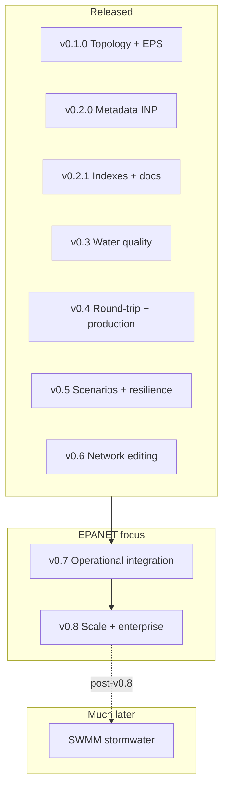

# Roadmap

Strategic plan for `pg_epanet`. Milestones are ordered by priority; items within each release are roughly ordered by implementation dependency.

**Positioning:** pg_epanet does not compete with the OWA-EPANET hydraulic solver (C). It competes on **where network data and workflows live** — inside PostgreSQL, joinable with PostGIS assets, SCADA time series, and application logic in a single database.

---

## Industry context

Water utilities and consultants typically operate across disconnected tools:

| Industry gap | Typical workflow today | pg_epanet opportunity |
|---|---|---|
| **GIS ↔ model silo** | Assets in PostGIS; hydraulics in EPANET desktop or WNTR (Python) | Topology, geometry, and metadata as SQL tables joinable with `public.assets` |
| **Mass scenario studies** | Python loops writing INP/RPT/OUT files to disk | Thousands of `epanet_simulate` calls in parallel inside Postgres |
| **Operations vs model** | SCADA in TimescaleDB/influx; model recalibrated manually | Compare measured vs simulated pressure in one query |
| **Water quality compliance** | Export to desktop for chlorine age / trace runs | WQ EPS results in SQL with regulatory aggregates |
| **Resilience planning** | Ad-hoc consultant scripts per study | Pipe failures, demand stress, and climate scenarios as SQL rows |
| **Managed cloud Postgres** | EPANET expects local filesystem (`/tmp`) | INP as `text`; future simulate without server-side files |
| **Multi-utility SaaS** | One VM or database per client | `network_id` tenancy + RLS + admin helpers |

The defensible value proposition: **eliminate the export → Python → re-import pipeline** for organisations that already store infrastructure data in PostGIS, and **scale bulk resilience studies** where Rust + Postgres parallelism beats sequential desktop runs.

---

## Release timeline

**Recommended order:** v0.7 → v0.8 → SWMM (horizon).

---

## v0.1.0 — First release ✅

**Released 2026-06-24.** Core topology import, PostGIS geometry, and hydraulic EPS simulation.

- [x] Generic INP section parser (`mod inp`) — engine-agnostic tokeniser
- [x] `CREATE EXTENSION pg_epanet` bootstraps the `epanet` schema, catalogue tables, result tables, GiST indexes, and `epanet.nodes` view
- [x] PostGIS dependency (`requires = 'postgis'`) with automatic install via `CASCADE`
- [x] `epanet_import(name, inp_text, srid)` — materialises INP sections into permanent tables
- [x] INP sections imported: `[JUNCTIONS]`, `[RESERVOIRS]`, `[TANKS]`, `[PIPES]`, `[PUMPS]`, `[VALVES]`, `[COORDINATES]`, `[VERTICES]`
- [x] Table-returning parse functions for all topology sections
- [x] PostGIS geometry: nodes → `Point`, pipes → `LineString` (with ordered vertices), pumps/valves → direct `LineString`
- [x] `epanet_delete(network_id)` — CASCADE delete of network, topology, and simulation results
- [x] `epanet_simulate(network_id)` — full EPS via OWA-EPANET 2.3 (`EN_openH / EN_runH / EN_nextH / EN_closeH`)
- [x] Per-timestep results in `node_results.step` and `link_results.step`
- [x] Original INP stored verbatim in `networks.inp_text`
- [x] Docker image + `docker-compose.yml`
- [x] Release tooling (`xtask/`) — Keep a Changelog, GitHub Releases

---

## v0.2.0 — INP completeness & simulation polish ✅

**Released 2026-06-25.** All EPANET metadata sections queryable in SQL; solver warnings surfaced to clients.

- [x] **Simulation warnings** — EPANET codes 1–99 emitted as PostgreSQL `WARNING` during `epanet_simulate`
- [x] `[PATTERNS]`, `[CURVES]`, `[OPTIONS]`, `[TIMES]`, `[CONTROLS]`, `[RULES]`
- [x] `[DEMANDS]`, `[EMITTERS]`, `[STATUS]`, `[SOURCES]`, `[REACTIONS]`, `[QUALITY]`, `[ENERGY]`, `[REPORT]`
- [x] `src/epanet_sections.rs` — multi-line parsers (patterns, curves, rules blocks)
- [x] Table-returning functions for every metadata section
- [x] `epanet_import` materialises metadata alongside topology

---

## v0.2.1 — Performance & documentation ✅

**Released 2026-06-25.** Query performance for graph traversal and simulation lookup; usage documentation.

- [x] B-tree indexes on `(network_id, node1)` and `(network_id, node2)` for `pipes`, `pumps`, `valves`
- [x] B-tree index on `simulation_runs(network_id)`
- [x] README usage guide (import → query → simulate → results)
- [x] README performance & indexes reference table
- [x] 45 tests (`cargo pgrx test pg18`)

**Carried forward (not yet solved):**

- Simulation writes temporary `.inp/.rpt/.out` files under `/tmp` on the Postgres server → v0.4
- `epanet_simulate` reads `inp_text` verbatim — metadata edits in SQL not reflected in simulation → v0.4
- Structured parse of CONTROLS/RULES into columns → v0.4 (`epanet_export`)

---

## v0.3 — Water quality & compliance analytics

**Goal:** extend simulation to water quality (WQ) and expose results for regulatory and operational reporting.

**Industry need:** utilities must demonstrate chlorine residuals, water age, and trace substance behaviour across the network. Consultants today export to EPANET desktop or WNTR for WQ runs, then manually join results back to GIS.

**Deliverables:**

- [x] FFI bindings: `EN_openQ`, `EN_initQ`, `EN_runQ`, `EN_nextQ`, `EN_closeQ` in `src/ffi.rs`
- [x] `epanet_simulate_quality(network_id, run_id)` — WQ on top of an existing hydraulic run
- [x] `epanet.node_quality_results` — concentration / water age / trace per node per timestep
- [x] `epanet.link_quality_results` — average quality per link per timestep
- [x] Indexes on `(run_id)` and `(run_id, step)` — same pattern as hydraulic result tables
- [x] SQL helpers (views or functions): min/max chlorine by zone, % nodes below threshold, mean water age by DMA (when node mapping exists)

**Depends on:** metadata sections `[SOURCES]`, `[REACTIONS]`, `[QUALITY]` imported in v0.2.0.

**Note:** Zone/DMA aggregates require node mapping (v0.6); v0.3 ships `node_quality_envelope` view and `epanet_count_nodes_below_threshold`.

---

## v0.4 — Round-trip, validation & production hardening ✅

**Goal:** make pg_epanet a two-way model store and production-ready on managed Postgres.

**Deliverables:**

- [x] `epanet_export(network_id) → text` — regenerate a valid INP from stored tables (CONTROLS/RULES as `rule_text`)
- [x] `epanet_validate(network_id)` — orphan nodes, links referencing missing nodes, disconnected components, dangling curve/pattern references
- [x] **Simulate from tables** — `epanet_simulate` / `epanet_simulate_quality` rebuild INP from SQL before running; `epanet_refresh_inp` for explicit sync
- [x] `epanet_import(..., replace := true)` — idempotent import by network name
- [x] **Configurable temp directory** — GUC `pg_epanet.temp_dir` (EPANET C API still requires file paths; set to a writable dir on managed Postgres)
- [x] Import performance: batch geometry `UPDATE`s
- [x] `epanet_import_file(network_name, file_path, srid)` — superuser, server-side read

**Note:** True in-memory EPANET open is not supported by OWA-EPANET; v0.4 uses configurable temp paths instead of hard-coded `/tmp`.

---

## v0.5 — Scenarios, resilience & comparative analytics ✅

**Goal:** support multi-scenario and resilience workflows entirely in SQL **without mutating the base network**.

**Design principle:** the imported INP (`networks.inp_text`) and topology tables are the **canonical baseline**. All what-if changes (demand stress, pipe closure, fire flow, pump speed) live in **`epanet.scenarios`** + **`epanet.scenario_overrides`**. Simulation builds an effective INP in memory only.

**Deliverables:**

- [x] `epanet.scenarios` + `epanet.scenario_overrides` — parameter sets per `network_id`
- [x] `epanet_simulate_scenario(scenario_id)` — overlay base INP + run EPS; `simulation_runs.scenario_id` tracks lineage
- [x] `epanet_compare_runs(run_id_a, run_id_b)` — pressure/flow deltas per node/link
- [x] **Pipe closure criticality** — `epanet_scenario_pipe_closure(network_id, name, pipe_id)`
- [x] **Fire flow** — `epanet_scenario_fire_flow(network_id, name, junction_id, required_flow)`
- [x] Global `demand_multiplier` on scenarios; per-element overrides (junction demand, pipe status/roughness, pump speed, options, status)

**Parallel execution:** each `epanet_simulate_scenario` call is independent — safe across sessions (see README).

---

## v0.6 — Network topology editing ✅

**Goal:** add, remove, and connect hydraulic elements without re-importing a full INP — with scenario-scoped provisional elements so the baseline stays untouched.

**Deliverables:**

- [x] **`epanet_add_junction` / `epanet_add_pipe`** — insert into base tables + coordinates + geometry
- [x] **`epanet_add_scenario_junction` / `epanet_add_scenario_pipe`** — provisional elements in `epanet.scenario_elements`
- [x] **`epanet_remove_element` / `epanet_remove_scenario_element`**
- [x] **`epanet_connect_nodes`** — re-endpoint pipes/pumps/valves
- [x] **`epanet.scenario_elements`** + **`epanet.scenario_element_vertices`** — overlay-only topology
- [x] **`epanet_merge_scenario_into_base(scenario_id)`** — promote scenario elements + overrides, refresh INP
- [x] Scenario simulate applies provisional elements to effective INP

**Follow-ups (v0.6.x / v0.7):**

- [x] `epanet_create_network` — build from empty INP shell (v0.6.1)
- [x] `epanet_add_pump`, `epanet_add_valve`, `epanet_add_tank`, `epanet_add_reservoir` helpers (v0.6.1)
- [x] Metadata builder helpers — patterns, curves, options, controls, etc. (v0.6.1)
- [ ] `epanet_validate` extensions after topology edits
- [ ] `epanet_export` includes scenario elements when exporting effective state

---

## v0.7 — Operational integration & digital-twin patterns

**Goal:** bridge live operational data (SCADA, AMI) with the hydraulic model inside Postgres.

**Industry need:** AMI and SCADA produce continuous time series; the hydraulic model is static until someone manually recalibrates. A digital twin requires joining telemetry, topology, and simulation in one place — not three export/import steps.

**Deliverables (patterns, no vendor lock-in):**

- [ ] `epanet.node_mapping` — `(network_id, node_id, external_id, scada_tag, asset_gid)` with optional join to GIS asset tables
- [ ] Views or documented conventions: `model_vs_scada` — join `node_results` with external reading tables (e.g. TimescaleDB hypertable in `public.scada_readings`)
- [ ] **`epanet_apply_demands_scenario(scenario_id, source)`** — scenario-based demand update (not base network)
- [ ] **Snapshot versioning** — `network_versions` or temporal tables for topology/INP audit trail
- [ ] **Calibration hooks** — roughness/demand overrides via scenarios + RMSE vs SCADA primitives

TimescaleDB integration: documented recipes only — no hard dependency.

---

## v0.8 — Scale, packaging & multi-tenant

**Goal:** production deployment at utility and consultant scale.

**Industry need:** multi-utility SaaS, very large EPS runs (111k+ result rows per run already validated on a real Costa Rica network in v0.1.0), and installation without a Rust toolchain on every server.

**Deliverables:**

- [ ] Partition `node_results` and `link_results` by `run_id` (native PostgreSQL partitioning)
- [ ] `epanet_admin_*` helpers — list networks, list runs, table sizes, purge old runs
- [ ] Example Row-Level Security policies for multi-tenant `network_id` / organisation isolation
- [ ] Configurable guardrails — GUCs or config table for `max_nodes`, simulate timeout, max parallel runs
- [ ] Packaging: PGXN, release binaries, versioned Docker image with prebuilt extension
- [ ] Attach EPANET `.out` binary as `bytea` on `simulation_runs` for downstream desktop tools
- [ ] PostgreSQL 19 compatibility pass (pgrx feature flag already exists)

---

## Horizon — SWMM (post-v0.8)

SWMM shares the section tokeniser in `src/inp.rs` but is a distinct product: separate schema, OWA-SWMM FFI, hydrology semantics, and a different user base (stormwater vs distribution).

> **Not planned until the EPANET cycle through v0.6–v0.8 is complete.**

**Phase 1 — parse & import:**

- [ ] `swmm_import(name, inp_text, srid)` — parse SWMM `.inp` into `swmm` schema tables
- [ ] Node tables: junctions, outfalls, storage units
- [ ] Link tables: conduits, weirs, orifices, pumps
- [ ] Table-returning functions: `swmm_junctions()`, `swmm_conduits()`, etc.
- [ ] PostGIS geometry for SWMM nodes and links

**Phase 2 — simulation (optional, later):**

- [ ] Hydraulic/hydrology simulation via OWA-SWMM C toolkit
- [ ] Result tables analogous to `node_results` / `link_results`

---

## Backlog / research

Not scheduled into a semver milestone. Candidates for future prioritisation based on user demand.

### Analytics & graph

- **Connectivity analysis** — detect isolated subgraphs, service area per reservoir/tank
- **Critical pipe ranking** — betweenness or failure-impact scoring (pgRouting or custom SQL/graph functions)
- **NRW / water balance** — join simulated demands vs district metered consumption
- **Pump energy optimisation** — SQL over `energy` metadata + EPS results for cost scenarios
- **Leak localisation** — emitter calibration against night-line pressure patterns

### Data integration & export

- **Uncertainty / Monte Carlo** — generate N parameter variants in SQL → N simulation runs without leaving the database
- **Foreign Data Wrapper** — read INP from S3, HTTP, or object storage without staging table
- **GeoJSON / FGDB views** — standard GIS export without shapefile round-trip
- **MVT vector tiles** — `ST_AsMVT` views for QGIS and web maps directly from `epanet.pipes`
- **Open standards alignment** — Utility Network / IFC export research

### Operations & scheduling

- **pg_cron recipes** — nightly hydraulic refresh, stale-run cleanup
- **Scenario management** — named parameter libraries shared across networks (extends v0.5)
- **Binary result retention policy** — tiered storage for `.out` files vs SQL aggregates

### Platform

- **Simulation resource isolation** — per-role limits, queue table for long-running jobs
- **Read replicas** — document simulate-on-primary / query-on-replica patterns
- **Extension observability** — `pg_stat` wrappers, simulate duration logging

---

## How to contribute

Pick an unchecked item from the next open milestone (currently **v0.7 — operational integration**).

See [README.md](README.md) for current API and [CHANGELOG.md](CHANGELOG.md) for release history.
